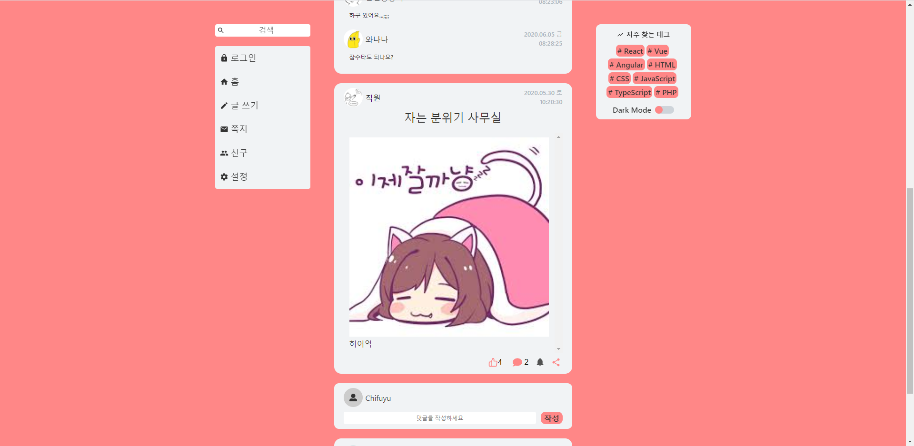

# Board Proejct

## Intro

- 미니SNS 프로젝트입니다.
- 색상 컨셉은 따뜻한, 포근한 날씨로 컨셉을 잡았습니다.

## Version 1.03 (20.11.12)

### 라이브러리 업데이트

- React를 포함한 모든 라이브러리 버전이 업데이트됩니다. (React 16.3.1 → 17.0.1)

### 구조 변경

- 구조 변경: Presentational & Container → 단일 컴포넌트, fixed → sticky, HOC → Hooks
- 미디어 쿼리 너비가 변경되었습니다. (Small: 400 → 480, Medium: 999 → 1024, Large: 1000 → 1025~)
- 일부 styled-components 코드를 분할하였습니다.

### 기존 문제 해결

- Quill 경고가 보이지 않게 됩니다.

### 주요 기능 추가 및 개선

- 회원가입, 로그인, 로그아웃이 가능합니다. (1시간 유지)
- 프로필 이미지(최대 20MB) 등록이 가능합니다.
- 로그인 후 좌측 메뉴가 보이도록 변경됩니다.
- 유저 등급 → 일반 유저과 관리자 유저로 구성되며 관리자 유저는 게시글과 댓글을 삭제 처리할 수 있습니다.
- 댓글 작성 기능이 개선되고 수정, 삭제, 새로고침 기능이 추가됩니다.
- 친구 추가 및 유저 차단 기능이 개선되었습니다.
- 차단 목록에 유저 등록 후 게시글 숨김을 체크하면 차단 목록에 있는 모든 유저의 게시글만 숨김 처리됩니다.
- 순서가 정렬됩니다. 게시글 → 최근 순, 댓글 → 오래된 순
- 쪽지 기능이 삭제됩니다.

## Version 1.02

- 업데이트 기간 (20.09.11)
- 좋아요를 누르면 숫자가 오름과 동시에 아이콘이 변경됩니다.
- 좋아요 된 상태에서 한 번 더 누르면 좋아요 상태 전으로 변경됩니다.
- 사용자명, 제목, 내용으로 검색 가능한 기능이 추가되었습니다.
- 검색 결과가 없는 경우 3초 후 자동으로 홈 화면으로 이동됩니다.
- 댓글 작성 시간이 표시됩니다.
- 연동 로그인은 추후 제공할 예정입니다.

## Version 1.01

- 업데이트 기간 (20.06.12 ~ 20.06.16)
- 사용된 라이브러리와 프레임워크들 버전 업데이트를 하였습니다. (package.json)
- 공유하기 UI 구성 (해당 SNS 홈페이지 이동)
- 친구 추가, 차단 Logic 변경
- real-time 등록 (글 작성, 쪽지 전송 등)
- 좌측 메뉴 클릭 후 색상이 남아있던 문제 수정
- 쪽지 UI 개편 및 보내기 기능 추가
- 차단 시 차단된 유저의 글만 보이지 않습니다.
- 해당 유저에게만 온 메시지 보여줍니다.
- 자신과 관리자에게 쪽지를 보낼 수 없습니다.
- 로그인 이미지, favicon 변경
- 글 작성 후 본문 내용이 제대로 보이지 않던 현상 수정
- 댓글 개수가 0일 때, 댓글 UI가 보이거나 댓글 입력이 안 되는 현상 수정
- 글이 등록된 순서로 글 목록을 정렬합니다.
- UserData의 데이터 구조를 변경하였습니다.
- 손가락 버튼(좋아요)을(를) 누르면 하트 아이콘으로 변경
- 기존 test 이미지 변경

## Version 1.0

### Main Features

- 프로젝트 진행 기간 (20.03.01 ~ 20.03.14)
- Dark Mode
- SNS처럼 댓글 작성이 가능합니다.
- 친구 추가
- 글 쓰기
- 쪽지
- 로그인

## Library & Framework

- 개발하면서 사용된 라이브러리 및 프레임워크는 package.json을 보거나 아래를 참조하세요.

### Frond-End

1. React
1. TypeScript
1. classnames
1. Styled-components
1. Redux
1. React-Redux
1. immer
1. Typesafe-actions
1. Redux-saga
1. Axios
1. Redux-DevTools-Extension
1. React-Icons
1. React-scroll
1. React-Quill
1. React-Cookie
1. Material-ui
1. ESLint, Prettier

### Back-End

1. Express
1. dotenv
1. cors
1. cookie-parser
1. express-session
1. bcrypt
1. passport
1. passport-local
1. pm2
1. helmet
1. hpp
1. morgan
1. cross-env
1. nodemon

### DataBase

1. mysql2
1. sequelize, sequelize-cli
